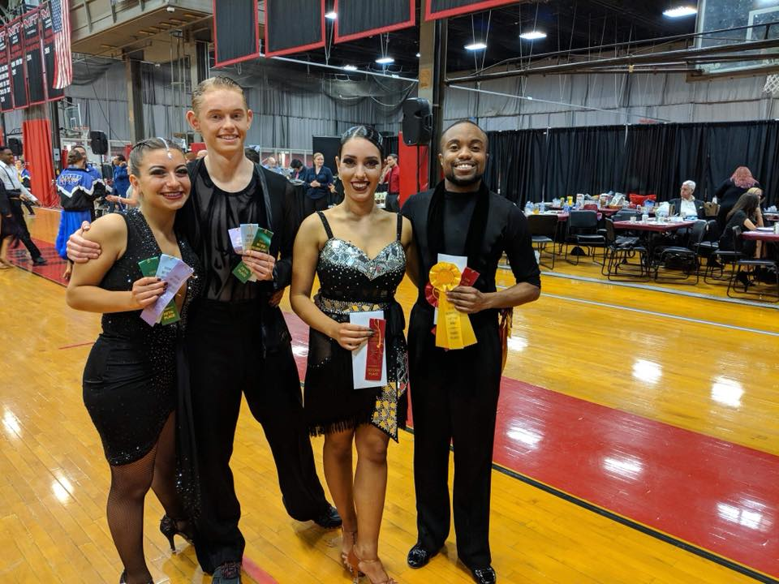
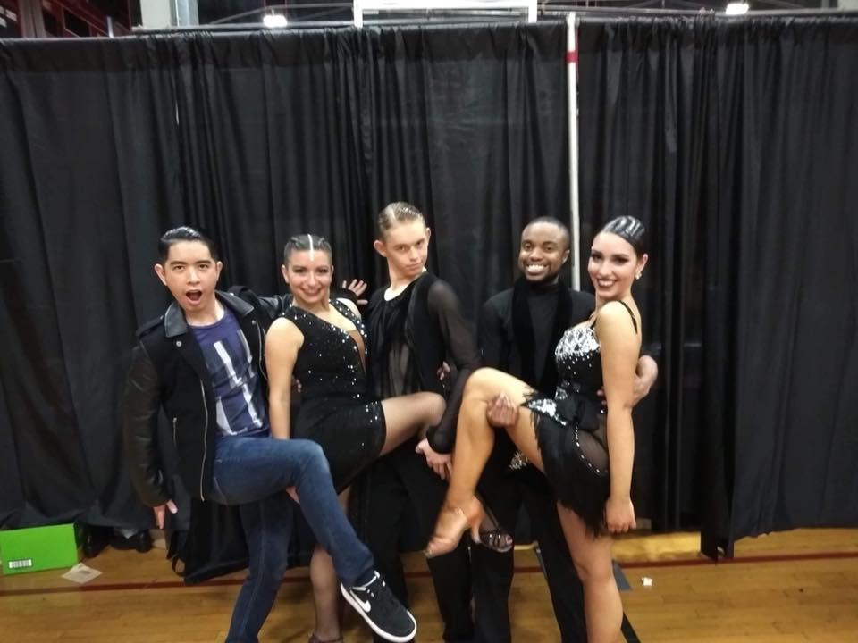
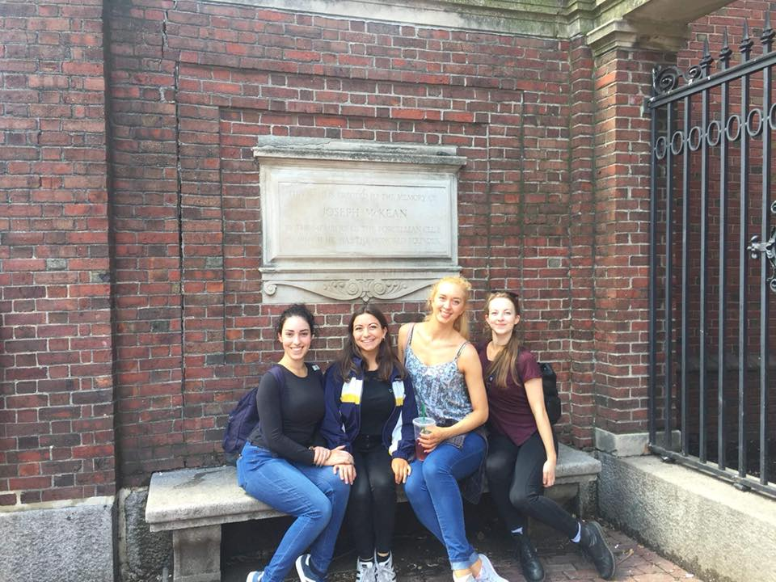
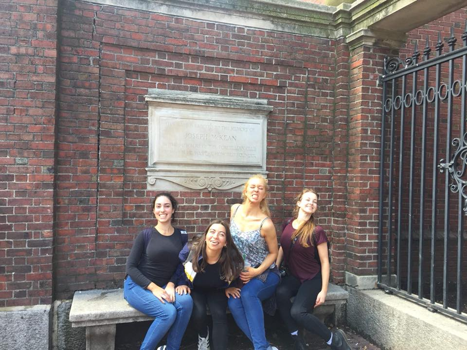

<!-- https://www.facebook.com/groups/168466220024235/permalink/773694252834759/ -->

A massive congratulations to everyone who attended MIT Open this weekend!! You all danced fantastically, against some tough competition, and an even tougher dance schedule, and were amazing representatives for the team on an international level! Here are the highlights from the day:

# Ballroom

- Antony and Joanna: 3rd Pre-Champ WTFQ, 3rd Pre-Champ VW, & 3rd Overall Pre-Champ
- Sirawit and Yue: 5th Pre-Champ VW
- Henry and Sarah: 7th Pre-Champ WTFQ
- Dan and Caro: Championship semi-finalists

# Latin

- Devon and Evgenia: 2nd Novice CSR, 3rd Pre-Champ CSRJ, 2nd Pre-Champ P, 3rd Overall Pre-Champ
- Ben and Kerys: 7th Novice CSR, 6th Pre-Champ CSRJ, 5th Pre-Champ P

Thank you to Matthew for making this possible, and to MIT for being incredible hosts! We had a fantastic time and can't wait to return next year!

---

Go IC!!
