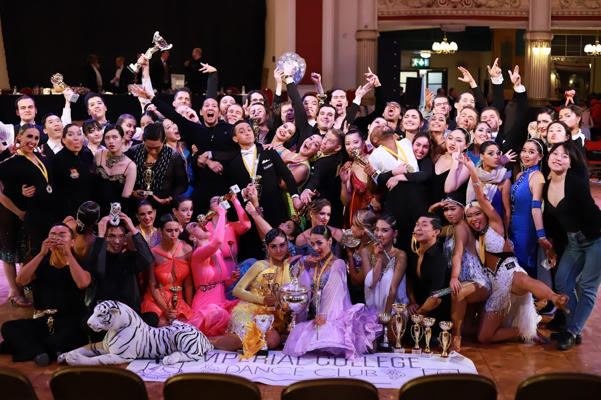
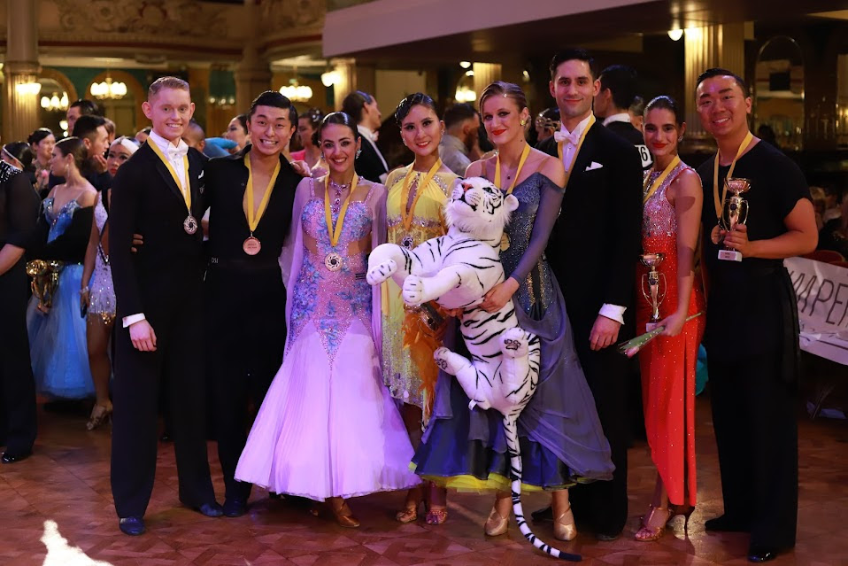
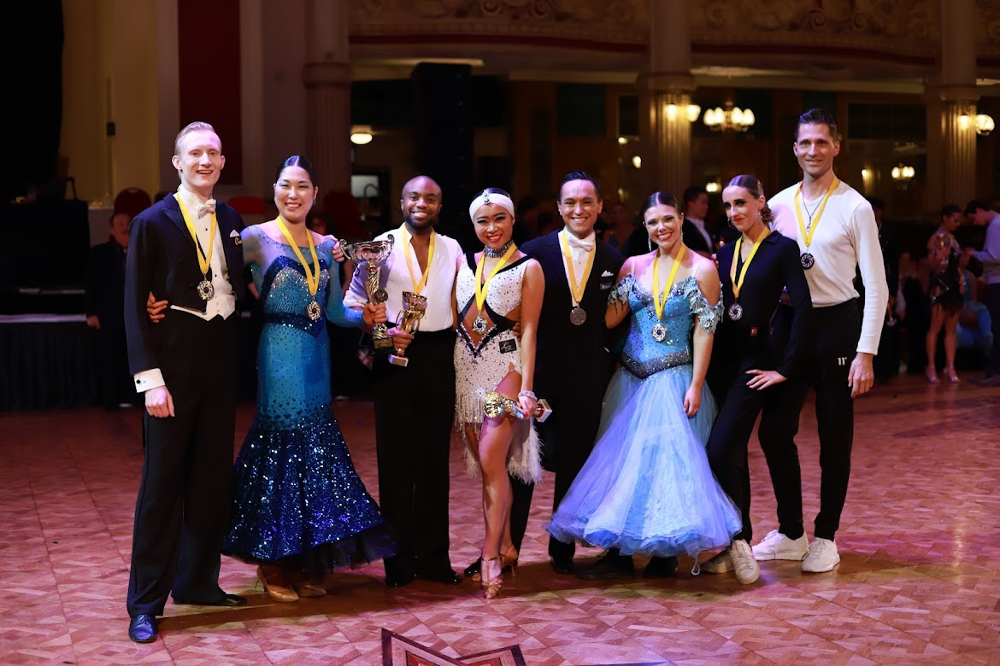

The Inter Varsity Dance Competition 2022 took place on 26/02/22 in Blackpool’s Winter Gardens. 71 members of the IC Dance Club competed on Saturday and each and every one of them should be proud of their achievements!!

Congratulations to everyone who competed at the competition; you were all assets to the team and we couldn’t have done it without your skill and team spirit throughout the day! Every member of the team made Blackpool really enjoyable this year, so thank you all!!! Shout out as well to those who came along as spectators in support of the Dance Club!

Thanks also goes to Bowen, Sophia, Izabela and Madison who organised the coach, hotel, competition entries and admin so brilliantly. Without them, literally none of us would have been there!

Last, but by no means least, huge thanks goes to our coaches, Laura, Damiano and Marika. They go above and beyond with their guidance, support and coaching and we can never thank them enough!

Every ICDC competitor deserves a well-earned rest now!!!

# Finalists

## Ballroom

- BEGINNERS WALTZ: 3rd Jake and Alys
- BEGINNERS QUICKSTEP: 1st Jake and Alys
- PRE-INTER WQ: 6th Warren and Xinyuan, 7th Stefano and Sophia
- INTER WTQ: 6th Bowen and Nadine
- ADV WTVQ: 2nd Victor and Iris, 3rd Ben and Zoë, 7th Yo-Der and Maria
- EX-STUDENT NOVICE WQ: 3rd Carsten and Priyanka
- EX-STUDENT INTER WTQ: 3rd Matt and Emma
- SAME-SEX WQ: 5th Rachael and Niki

## Latin

- BEGINNER CHA: 7th Joseph and Beatriz
- PRE-INTER CJ: 1st Lewis and Momo
- INTER CRJ: 7th Chen-E and Cynthia
- ADV CRPJ: 4th Kennedy and Maya, 5th Bowen and Sophia, 6th Ben and Zoë
- EX-STUDENT NOVICE CJ: 6th Paweł and Julia
- EX-STUDENT INTER CRJ: 2nd Matt and Emma
- EX-STUDENT ADV CSRPJ: 3rd Kien and Kerys, 5 Devon and Katie

# Team Matches

- STUDENT TEAM MATCH: 1st IMPERIAL A

- EX-STUDENT TEAM MATCH: 1st Imperial A, 5th Imperial B
