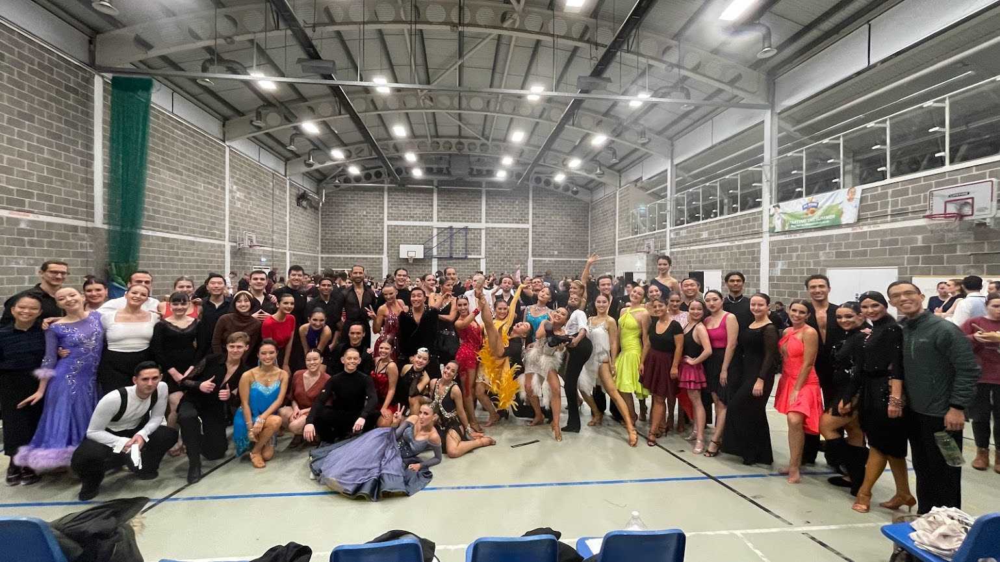

It’s been said a lot but WELL DONE and CONGRATULATIONS to everyone who took part in yesterday’s comp in Nottingham!!!!!

We’re all so proud of you! Let’s keep our winning streak going into 2022 and beyond!!!

# INTER-UNIVERSITY TEAM MATCH:

- IC TEAM A – 1ST TEAM MATCH DIV 1
- IC TEAM B – 5TH TEAM MATCH DIV 1

# BALLROOM FINALISTS

- BEGINNER WALTZ: 2nd Jake and Alys
- BEGINNER QUICKSTEP: 1st Jake and Alys
- NOVICE DEVISION 1: 2nd Stefano and Sophia; 3rd Warren and Cassia
- PRE-INTERMEDIATE: 3rd Lewis and Hannah
- INTERMEDIATE: 4th Dominic and Nina; 6th Bowen and Nadine
- ADVANCED: 1st Victor and Iris; 2nd Ben and Zoe
- EX-STUDENT NOVICE: 2nd Zoe and Miaomiao
- EX-STUDENT INTERMEDIATE: 4th Alistair and Izumi; 6th Pawel and Julia; 7th Matthew and Emma
- OPEN FOXTROT: 1st Victor and Iris; 2nd Ben and Zoe

# LATIN FINALISTS

- BEGINNERS JIVE 3rd Jake and Alys
- NOVICE DIVISION 1: 3rd Madison and Stephanie
- NOVICE DIVISION 2: 5th Kaixin and Alicia
- PRE-INTERMEDIATE: 1st Lewis and Momo; 6th Warren and Swannie
- INTERMEDIATE: 2nd Chen-e and Cynthia
- ADVANCED: 1st Kennedy and Maya; 2nd Matthew and Mariya; 3rd Ben and Zoe; 4th Bowen and Sophia
- EX-STUDENT NOVICE: 2nd Pawel and Julia; 3rd Alistair and Helena; 4th Zoe and Miaomiao
- EX-STUDENT INTERMEDIATE: 1st Stefano and Evgenia; 5th Matthew and Emma
- EX-STUDENT ADVANCED: 1st Philip and Anastasia; 2nd Devon and Katie; 4th Chris and Adela
- OPEN SAMBA: 1st Philip and Anastasia; 2nd Devon and Katie; 3rd Chris and Adela; 4th Matthew and Mariya; 5th Ben and Zoe
