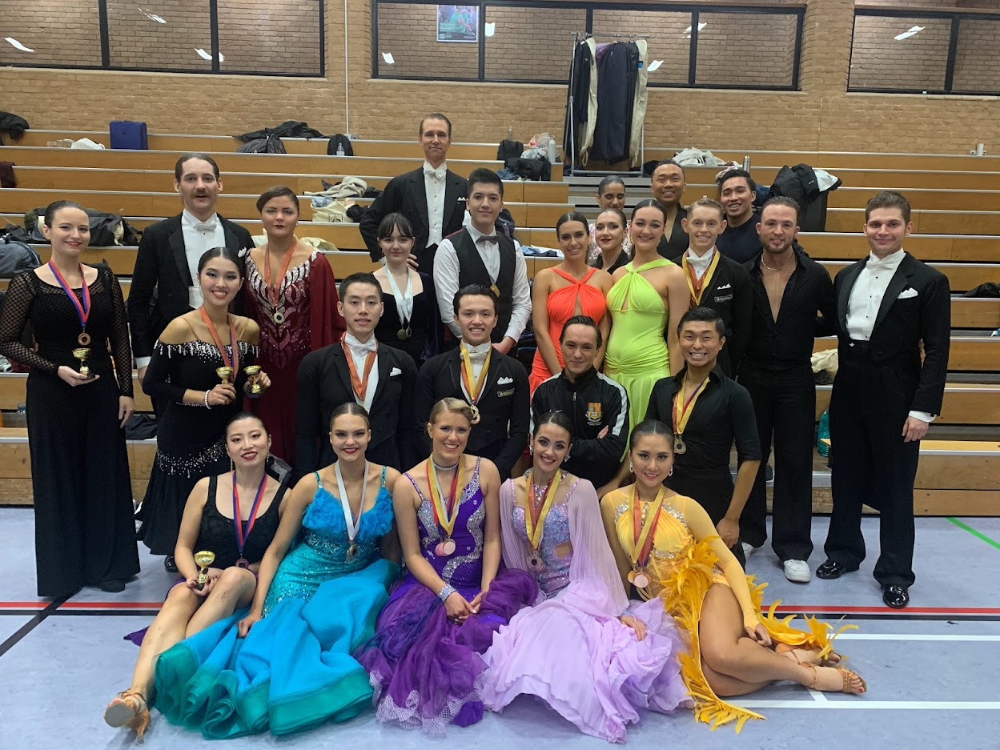

So, SUDC apparently happened (I still don’t really believe it tbh…) and the IC Dance Club did REALLY, REALLY WELL!!!

Congratulations to all those who competed; you keep doing the Dance Club proud!!! Only Blackpool to go now, let’s keep it up!!!

# FINALISTS

## TEAM MATCH FINALISTS

DIVISION 1: 1st TEAM A

## TEAM KNOCKOUT

1st IMPERIAL COLLEGE

## BALLROOM FINALISTS

- BEGINNER WALTZ: 2nd Jake and Ana
- BEGINNER QUICKSTEP: 2nd Jake and Ana
- PRE-INT WQ: 2nd Stefano and Sophia
- INTER WFQ: 2nd Bowen and Nadine, 3rd Lewis and Hannah, 4th George and Lucy
- ADV WTFQ: 2nd Yo-Der and Maria, 3rd Ben and Zoë, 4th Dom and Nina
- EX-STUDENT NOV WQ: 1st Zoe and Miaomiao
- EX-STUDENT INT WFQ: 2nd Matt and Emma, 3rd Paweł and Julia
- SAME-SEX WQ: 1st Rachael and Niki
- OPEN VW: 2nd Ben and Zoë, 3rd Yo-Der and Maria, 4th Dom and Nina
- OPEN TANGO: 2nd Ben and Zoë, 3rd Yo-Der and Maria, 6th Dom and Nina

## LATIN FINALISTS

- PRE-INT CJ: 1st Lewis and Momo
- INTER CSJ: 2nd Chen-E and Cynthia, 3rd Dom and Nina
- ADV CSRJ: 1st Kennedy and Maya, 3rd Ben and Zoë, 4th Bowen and Sophia, 6th George and Zixi
- EX-STUDENT NOV CJ: 3rd Paweł and Julia, 4th Zoe and Miaomiao
- EX-STUDENT INT CSJ: 1st Matt and Emma
- SAME SEX CJ: 1st Lucy and Nadine
- OPEN RUMBA: 1st Kennedy and Maya, 3rd Ben and Zoë, 4th Bowen and Sophia, 5th George and Zixi, 7th Dom and Nina, 8th Lewis and Momo
- OPEN PASO: 1st Kennedy and Maya, 3rd Ben and Zoë, 4th Bowen and Sophia
