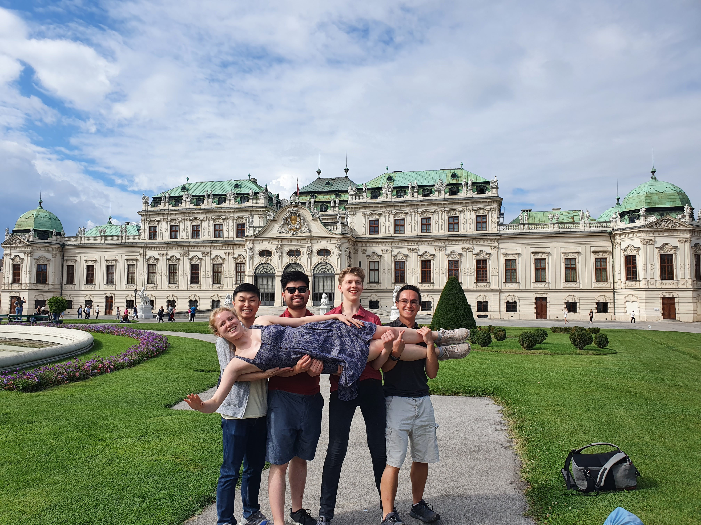

At the start of September this year, members of the Ballroom and Latin team travelled to the Austrian capital to take the dance floor by storm once again!

The main purpose of the trip was to participate in the Dancer Against Cancer Ball in the Hofburg Palace – the first to take place after two years.

We arrived in Vienna on the day before the ball, so, having dropped our bags at the hostel, there was ample time for a bit of sightseeing around the endlessly beautiful city – the Kaiserkirche, Stefansdom, the Albertina Modern – before travelling to a lake for a night-time swim (for those who were brave enough!). Following this, we had our first meal as a whole group in a local beer garden, which was the first taste of Austrian food for many of us – it did not disappoint!

The stunning KaiserKirche

Meal by the River

Schönbrunn Palace

A beautiful Oversway!

The next day, after hunting out a place to have brunch near the hostel, we headed to Schönbrunn Palace to admire the majestic architecture and its sprawling gardens (and take lots of photos!). We then headed to the Albertina Museum to view some incredible works of art from the likes of Monet and Picasso.

Picture Perfect Recreation (especially Bowen at the back)

So Close!

After having had yet another fantastic meal in the centre, it was time for the ball! When we had made our preparations and had trekked over to the stunning Hofburg Palace, we arrived (fashionably late) at the ball just in time to see the debutantes. They performed a well-choreographed routine in the centre of the main ballroom, which marked the official start to the dancing; then we were off!

Between the two ballrooms and one disco, we danced with many new people, with several of us on the floor at pretty much all times. We continued this from around 8pm to 4am (we’re hardcore!) with welcome breaks for performances from local dance groups and one absolutely mad dance called a ‘Quadrille’ that involved us racing around tightly formed lines swapping partners and even galloping with gay abandon in a circle and underneath peoples’ arms! Doubtless to say, it was an incredible night.

Excellent floorcraft between two of our couples...

Dancing with the Locals

Cafe Central

A Normal Day at Belvedere...

The following day, the majority of us visited the famous ‘Café Central’ for a rather classy breakfast. After this, we began to split ways, with some flying back home, some flying to Prague, and some staying on to see more of Vienna. Those who stayed saw another of Vienna’s treasures: the Belvedere Palace. However, this drew the trip to a close for most, with only a few staying until the next day.

Needless to say, this trip was very packed, with an abundance of various activities for all to enjoy; we can’t wait to do another one!
